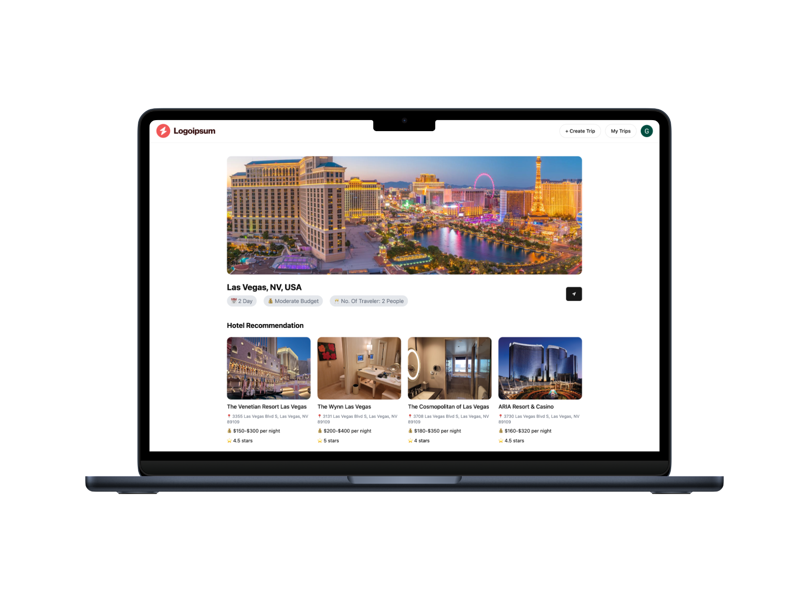

# 🌍 AI Trip Planner — Your Personalized Travel Companion

🚀 **Live Demo**: [ai-trip-planner.vercel.app](https://ai-trip-planner-taupe-tau.vercel.app/)

An intelligent, personalized trip planning web application powered by **Google Gemini AI** and **Firebase**. Easily sign up, enter your preferences, and get your own **custom itinerary with hotel recommendations** — all within seconds!

---

## 📸 Preview

  

---

## 🛠️ Tech Stack

| Technology | Usage |
|------------|-------|
| **React.js** | Frontend Framework |
| **Tailwind CSS** | Styling & Responsive Design |
| **Firebase** | Auth, Firestore Database |
| **Google Gemini API** | Generating Itinerary & Hotel Suggestions |
| **React Router** | Page Navigation |
| **Vite** | Build Tool |
| **Vercel** | Deployment |

---

## ✨ Features

- 🔐 **Authentication System**
  - Sign Up / Sign In using Firebase Authentication
- 🧠 **AI-Powered Itinerary Generator**
  - Uses Gemini API to generate a full-day-by-day travel plan
- 🏨 **Hotel Recommendations**
  - Fetches 3–5 hotel suggestions for your destination
- 🗂️ **Firestore Integration**
  - Stores trip data in Firebase Cloud Firestore
- 🎯 **Responsive Design**
  - Mobile and desktop friendly
- ✨ **Modern UI**
  - Minimalist, user-friendly interface

---

## 🧪 How It Works

1. **Create Account** – Sign up using email/password
2. **Fill Form** – Enter trip details (destination, budget, travel mode)
3. **Generate Plan** – Gemini AI returns detailed itinerary + hotel list
4. **Save Trip** – Trip data is saved to Firebase Firestore
5. **Explore** – View saved trips anytime

---

## 📁 Folder Structure (Optional)

